# AIS Auth Platform

Discord bot + admin dashboard pre FEI STUBA server. Overuje študentov cez univerzitný LDAP ([AIS](https://is.stuba.sk/)), prideľuje im Discord rolu. Vytvorené pre študentov [FEI STUBA](https://www.fei.stuba.sk/).

Prepis staršieho Node.js bota ([ais-authentication](../ais-authentication)) na Java stack.

## Stack

- **Backend** — Spring Boot 4, Java 21, Maven. REST API, Spring Security (`oauth2-client`), Spring LDAP, JPA/PostgreSQL, Flyway.
- **Discord bot** — JDA, beží v tom istom procese ako backend (slash commandy volajú service vrstvu priamo, nie samostatný proces cez HTTP).
- **Frontend** — React 19, TypeScript, Vite.
- **Deployment** — `docker compose` (Postgres, Mailpit, backend, frontend za Caddy).

## Funkcie

- **Overenie študentov** — `/verify`, `/code`, `/manualverify`. Používateľ zadá AIS ID, dostane overovací kód na univerzitný e-mail (Spring Mail/Mailpit), po zadaní kódu appka overí identitu voči LDAP a prideľuje Discord rolu.
- **Admin dashboard** — per-guild správa cez Discord OAuth2 login. Nastavenia bota, warny (`/warn`, `/warns`, auto-punishment), audit log, access log, správa príkazov a rolí, hromadný re-check/wipe overených členov voči LDAP, prepínanie semestra, automatické mazanie správ, „Hacked Account Trap" automod (nastaviteľný trap kanál — ktokoľvek doňho napíše mimo výnimiek dostane permanent ban, voliteľne DM pred banom a zmazanie správ za posledných X hodín, všetko zalogované do audit logu aj spam logu).
- **Autorizácia** — super-admini (celá appka) + per-guild manažéri (len svoj server), vynucované na každom endpointe cez `GuildAccessService`.
- **Prihlasovanie** — Discord OAuth2 (`spring-boot-starter-oauth2-client`, vlastná `ClientRegistration` pre Discord). Appka si sama vydáva a validuje JWT session token + refresh token, žiadny externý identity provider.

## Screenshoty

**Discord bot**

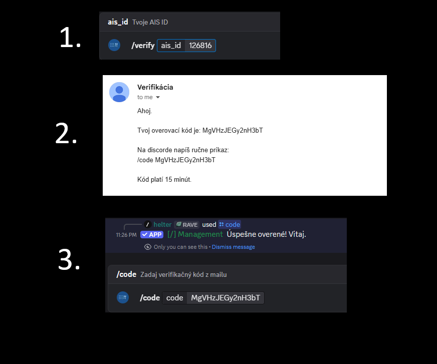
`/verify` + `/code` flow — zadanie AIS ID, overovací kód na e-mail, pridelenie roly.

**Login / výber servera**

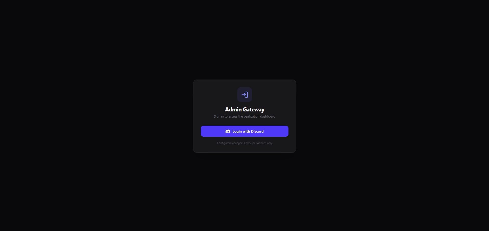
Discord OAuth2 login.

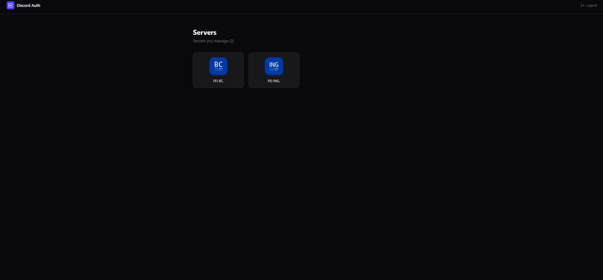
Výber servera (guildu), ktorý spravuješ — super-admin vidí všetky, manažér len svoje.

**Dashboard**

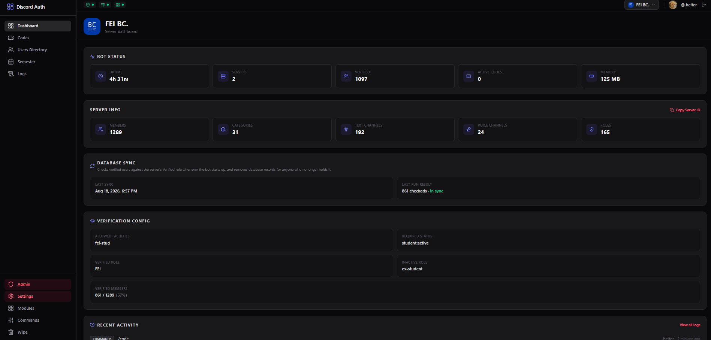
Prehľad servera — stav bota, počet overených členov, aktívne kódy, rýchle štatistiky.

**Overení používatelia / kódy**

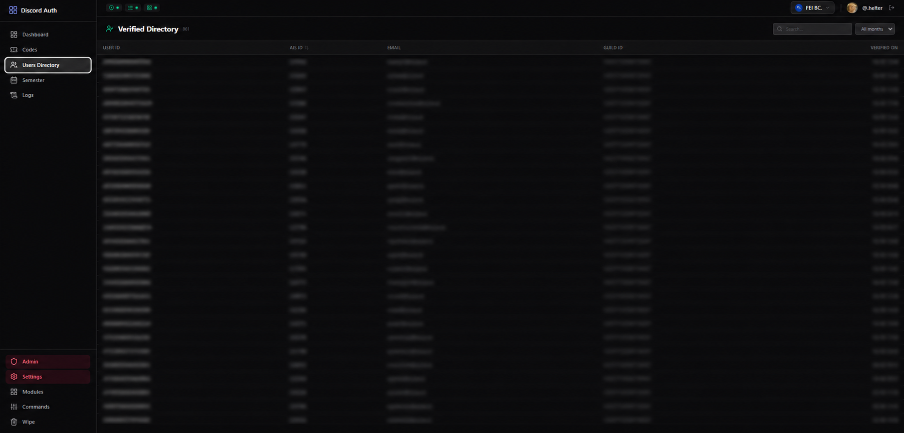
Zoznam overených členov, hromadný re-check/wipe proti LDAP.

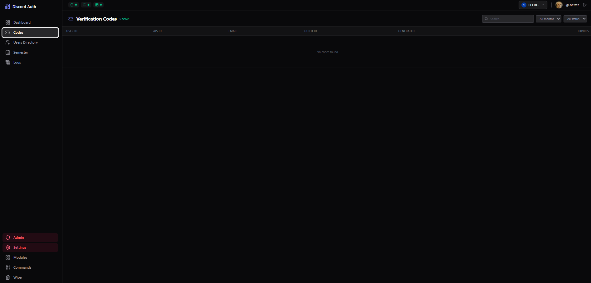
Aktívne overovacie kódy.

**Warny**

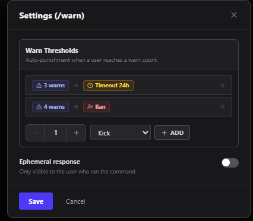
Warn systém (`/warn`, `/warns`), auto-punishment pri prekročení limitu.

**Moduly / automod**

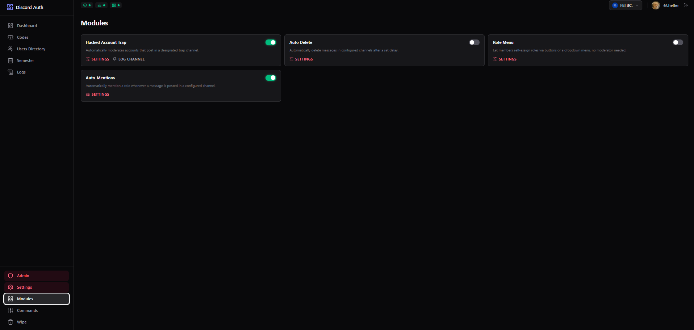
Prehľad zapnutých modulov.

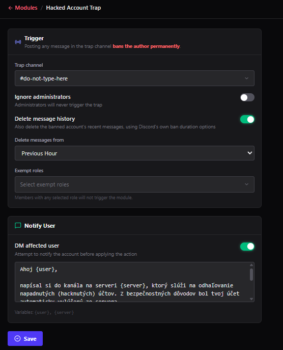
Nastavenie trap kanála, výnimiek a akcie pri triggeri.

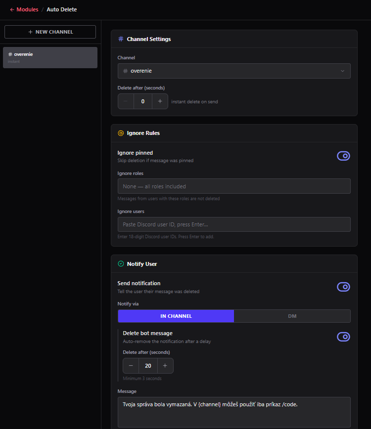
Automatické mazanie správ.

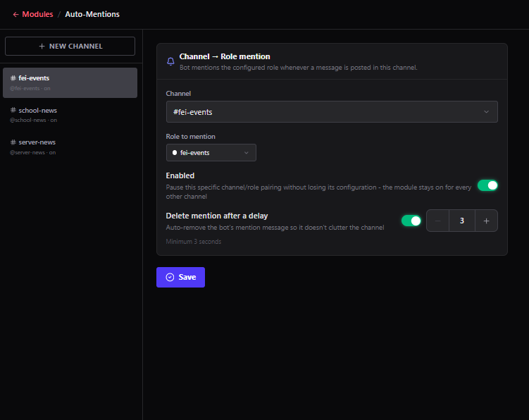
Automod pre mention spam.

**Role menu**

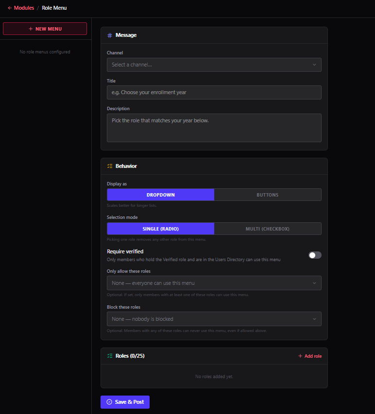
Správa self-service rolí cez Discord tlačidlá.

**Príkazy**

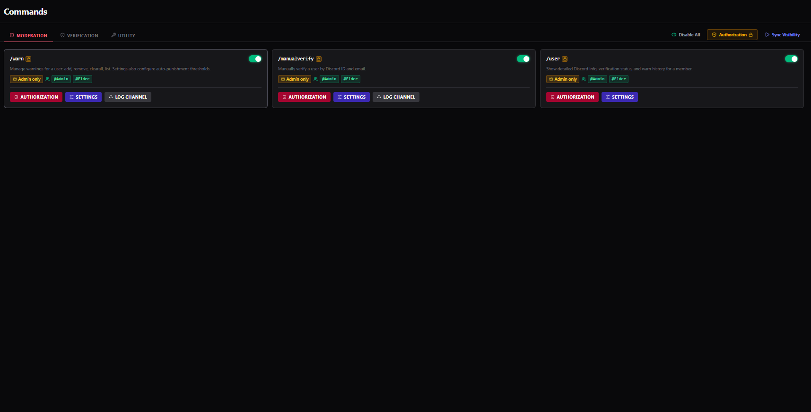
Zapínanie/vypínanie príkazov, per-guild permission overrides.

**Logy**

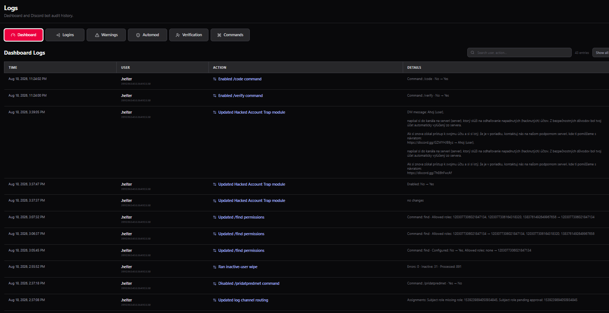
Audit log a access log admin/moderátorských akcií.

**Nastavenia**

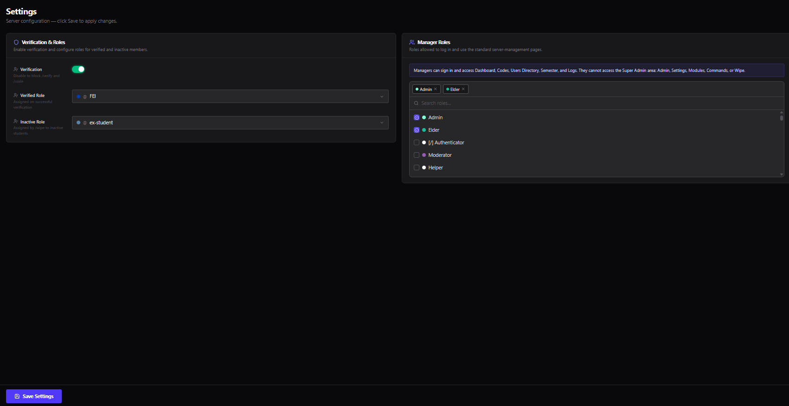
Nickname bota, timezone, ostatné per-guild nastavenia.

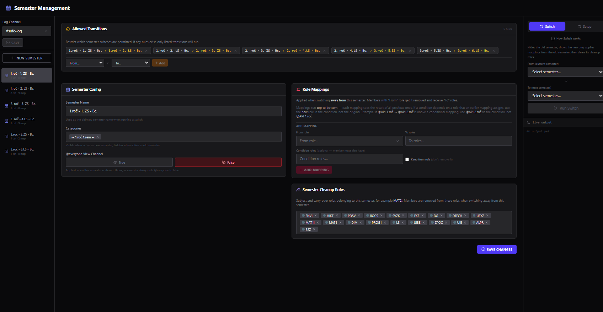
Prepínanie semestra.

**Super-admin**

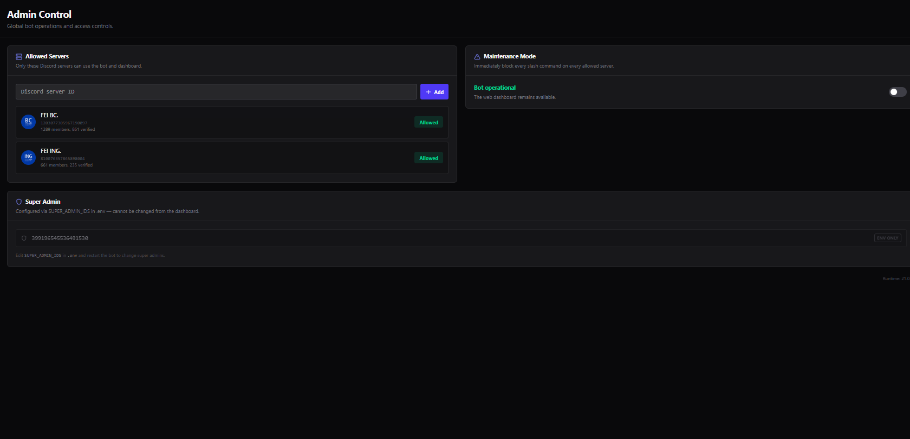
Globálna admin sekcia (mimo per-guild) — správa manažérov, super-admin nastavenia.

*(obrázky doplň do `docs/screenshots/` pod týmito názvami — README ich už linkuje)*

## Štruktúra repa

```
backend/    Spring Boot 4 (Java 21, Maven) — REST API, JPA, Security, LDAP, mail, Discord bot (JDA)
infra/      docker-compose (PostgreSQL, Mailpit, backend, frontend/Caddy)
frontend/   React 19 + TypeScript + Vite admin dashboard
```

## Lokálny vývoj

**Variant A — appky natívne (rýchlejší reload):**

```
cp infra/.env.example infra/.env   # uprav podľa potreby
docker compose -f infra/docker-compose.yml --env-file infra/.env up -d postgres mailpit
cd backend && ./mvnw spring-boot:run     # http://localhost:8080
cd frontend && npm install && npm run dev  # http://localhost:5173
```

**Variant B — celý stack v Dockeri:**

```
docker compose -f infra/docker-compose.yml --env-file infra/.env up -d --build
```

Frontend (za Caddy, proxuje `/api/` na backend) beží na `http://localhost:8081`, backend priamo na `http://localhost:8080` (potrebné pre Discord OAuth redirect).

Pre reálne prihlásenie treba vlastnú Discord OAuth aplikáciu (`DISCORD_CLIENT_ID`/`DISCORD_CLIENT_SECRET`) a Discord bota (`DISCORD_BOT_TOKEN`) — bez nich appka beží, ale login/bot sa nepripoja.

### Discord Developer Portal setup

**OAuth2 → Redirects**
Presné URI podľa `DISCORD_REDIRECT_URI` (`application.yml`), napr. `http://localhost:8080/api/auth/discord/callback` pre dev, + produkčná URL ak beží inde. Musí sedieť exactne (aj scheme/port).

**Bot → Privileged Gateway Intents**
`SERVER MEMBERS INTENT` + `MESSAGE CONTENT INTENT` — obe zapnúť (kód ich enable-uje v `DiscordBotService.java`). `PRESENCE INTENT` netreba.

**OAuth2 → General**
`Client ID`/`Client Secret` musia sedieť s `DISCORD_CLIENT_ID`/`DISCORD_CLIENT_SECRET` v env.

**Bot → Token**
`DISCORD_BOT_TOKEN` v env — reset tokenu v konzole = treba updatnúť env, inak bot sa nepripojí.

**Bot invite** (samostatný krok od login OAuth, cez OAuth2 URL Generator)
- scopes: `bot` + `applications.commands` (bez druhého slash commandy nepôjdu)
- permissions: Ban Members, Kick Members, Manage Channels, Manage Roles, Moderate Members (timeout), Send Messages, View Channels

**Role hierarchy** (nie checkbox v konzole, ale často zabudnuté)
Bot rola musí byť v server settings vyššie než rola, ktorú prideľuje/spravuje — inak `MANAGE_ROLES` zlyhá na Discord API úrovni.

**Public Bot** (Bot tab) — netreba zapínať, ak invite link zdieľaš len ty/tím.

## Konfigurácia

Všetko cez env vars, defaulty v `backend/src/main/resources/application.yml`.

**Overenie**
- `allowed-faculties` (`app.verification.allowed-faculties`, zoznam v `application.yml`, netreba env) — zoznam LDAP org-unit skratiek, ktoré appka pustí, teraz len `fei-stud`.
- `required-account-status` (`application.yml`, netreba env) — AIS status potrebný na overenie, teraz `student:active`.
- `VERIFICATION_TESTING_MODE` (default `false`) — `true` = `/verify` preskočí mail, kód ukáže priamo v Discorde.

**LDAP** — `LDAP_URL` (default `ldap://localhost:389`), `LDAP_BASE` (default `ou=People,dc=stuba,dc=sk`), `LDAP_USERNAME`, `LDAP_PASSWORD`.

**Mail** — `MAIL_HOST`, `MAIL_PORT`, `MAIL_USERNAME`, `MAIL_PASSWORD`, `MAIL_FROM`, `MAIL_SMTP_AUTH`, `MAIL_SMTP_STARTTLS`, `MAIL_SMTP_SSL`.

**Discord** — `DISCORD_CLIENT_ID`, `DISCORD_CLIENT_SECRET`, `DISCORD_REDIRECT_URI`, `DISCORD_BOT_TOKEN`, `DISCORD_GUILD_ID` (ak nastavené, slash commandy sa registrujú len na tento server, okamžite).

**Admin** — `SUPER_ADMIN_IDS` (Discord ID zoznam, čiarkou oddelené) — super-admini appky, obídu per-guild `GuildAccessService` kontrolu.

**JWT** — `JWT_SECRET`, `JWT_ACCESS_TOKEN_TTL_SECONDS` (default 300), `JWT_REFRESH_TOKEN_TTL_SECONDS` (default 2592000).

**Ostatné** — `DB_HOST`/`DB_PORT`/`DB_NAME`/`DB_USER`/`DB_PASSWORD`, `SERVER_PORT` (default 8080), `FRONTEND_URL` (default `http://localhost:5173`).

## Testy

Backend: 86 test súborov (JUnit 5, Mockito, Spring Boot Test, Testcontainers-Postgres pre integračné testy — reálna DB, nie mock). Pokrývajú service vrstvu, controllery (`*ControllerIntegrationTest`, plný Spring context + skutočný Postgres), Discord bot listenery/commandy, automod (Hacked Account Trap, auto-delete, auto-mention), warn systém, wipe/re-check proti LDAP, audit log, autorizáciu (`GuildAccessService`), role menu, semester switching, scheduling. Nepokryté zámerne: entity, DTO, exceptions, repository interfaces, config triedy (žiadna vlastná logika).

Spusti: `cd backend && ./mvnw test` (rýchle, bez integračných) alebo `./mvnw verify` (aj integračné, spúšťa Testcontainers → treba bežiaci Docker).

## CI

GitHub Actions (`backend-ci.yml`) spúšťa `./mvnw verify` proti reálnemu Postgresu cez Testcontainers pri každom push/PR dotýkajúcom sa `backend/`.

## Stav

Jadro appky (overenie, dashboard, autorizácia, audit log, Discord OAuth2 login s vlastným JWT, Docker nasadenie, CI) hotové a funkčné. Otvorené: WAR deploy na Tomcat/JBoss, nasadenie na AWS, samostatný modul v Kotline/Quarkuse.
